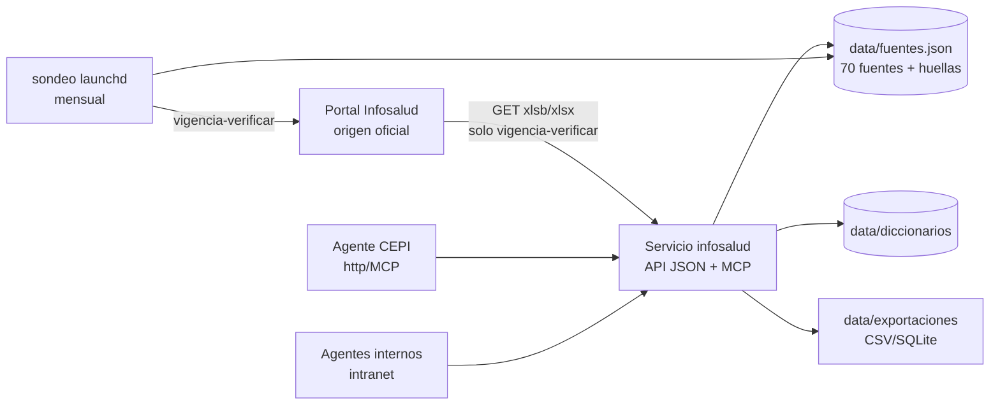
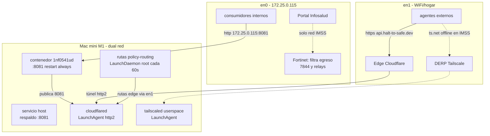
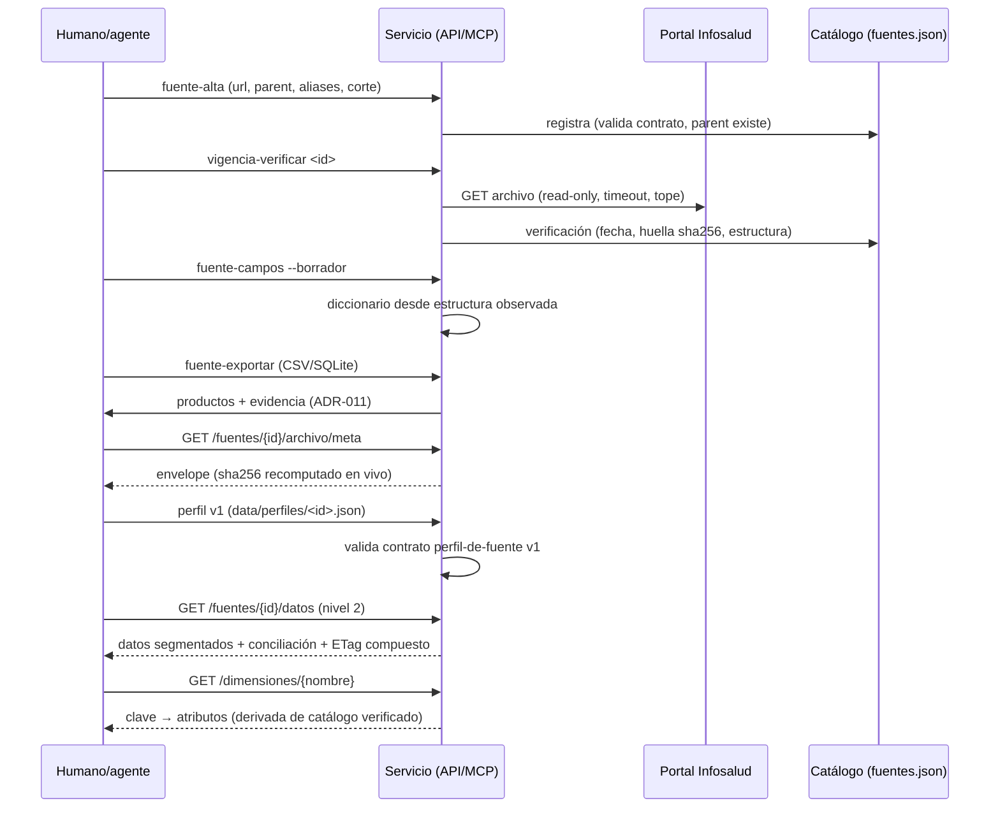
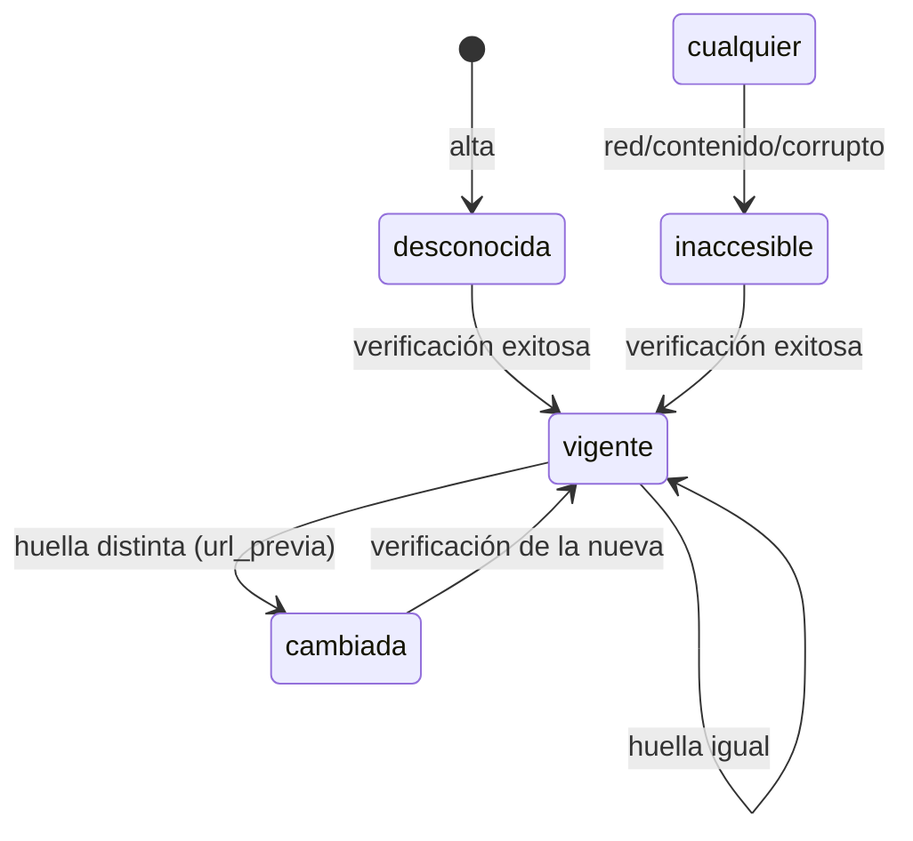

# Diagramas del sistema (mermaid — renderizan en GitHub)

## 1. Arquitectura lógica

## 2. Topología de red y exposición

## 3. Flujo de datos: del portal al consumidor

## 4. Máquina de estados: vigencia de una fuente

